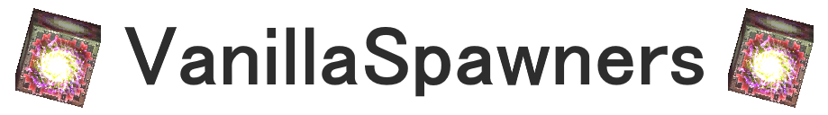

# VanillaSpawners

> CastleForge gameplay/control mod for managing vanilla generated spawner blocks, existing spawner activation, and random vanilla loot block generation in CastleMiner Z.

**Current mod version shown in source:** `0.0.1.0`



---

## Contents

- [Overview](#overview)
- [Why this mod exists](#why-this-mod-exists)
- [Features at a glance](#features-at-a-glance)
- [Requirements](#requirements)
- [Installation](#installation)
- [Quick start](#quick-start)
- [Command reference](#command-reference)
- [Configuration](#configuration)
- [Recommended setups](#recommended-setups)
- [Behavior notes](#behavior-notes)
- [Important ModLoaderExtensions note](#important-modloaderextensions-note)
- [Technical overview](#technical-overview)
- [Known limitations](#known-limitations)
- [Development notes](#development-notes)
- [Credits](#credits)
- [License](#license)

---

## Overview

**VanillaSpawners** is a CastleForge / ModLoader mod that brings the dedicated-server `VanillaSpawners` style controls into normal CastleForge-hosted CastleMiner Z sessions.

The goal is simple: let a host decide whether newly generated terrain should keep placing vanilla monster spawners and vanilla loot blocks, while also allowing existing spawner blocks to be made non-clickable without deleting them from the world.

At its core, the mod can:

- prevent new vanilla cave / alien / hell / boss spawner blocks from generating,
- prevent existing vanilla spawner blocks from being activated,
- prevent new vanilla `LootBlock` / `LuckyLootBlock` blocks from generating,
- keep existing worlds safe by not deleting saved chunks automatically,
- create a simple per-mod INI file under `!Mods\VanillaSpawners`,
- reload that INI in-game with a slash command.

This makes it useful for CastleForge players who want cleaner world generation, reduced vanilla spawner clutter, or server-style control while hosting through the regular CastleMiner Z game.

---

## Why this mod exists

The dedicated server plugin version of **VanillaSpawners** controls vanilla spawner and loot generation for dedicated server worlds.

This CastleForge mod recreates that idea for the normal CastleForge mod ecosystem. Instead of relying on the dedicated server plugin API, this version uses Harmony patches inside the local game/host process.

That means it is best suited for:

- local CastleForge worlds,
- hosted multiplayer sessions where the host runs CastleForge,
- testing world-generation behavior without using the dedicated server plugin system,
- players who want the same feature split as the dedicated-server `VanillaSpawners` plugin.

---

## Features at a glance

| Feature                            | What it does                                                                                   |
|------------------------------------|------------------------------------------------------------------------------------------------|
| New spawner generation toggle      | Allows or blocks newly generated vanilla cave / alien / hell / boss spawner blocks             |
| Existing spawner activation toggle | Lets existing vanilla spawners remain in the world but prevents click activation when disabled |
| New loot block generation toggle   | Allows or blocks newly generated vanilla `LootBlock` and `LuckyLootBlock` blocks               |
| Safe existing-world behavior       | Does not automatically delete or edit already-saved chunks                                     |
| Simple INI config                  | Creates `VanillaSpawners.Config.ini` on first launch                                           |
| Runtime reload                     | Reloads config with `/vanillaspawners reload`                                                  |
| Status command                     | Prints the active runtime values in chat/feedback                                              |
| ModLoaderExtensions commands       | Uses CastleForge's shared command infrastructure                                               |
| Harmony patches                    | Hooks the vanilla generation and clickable-spawner paths directly                              |
| Vanilla fallback behavior          | Setting `Enabled=false` returns the patched behavior to vanilla defaults                       |

---

## Requirements

VanillaSpawners is built for the CastleForge ecosystem and requires:

- **CastleMiner Z**
- **CastleForge ModLoader**
- **ModLoaderExtensions**

The mod declares `ModLoaderExtensions` as a required dependency because it uses the shared CastleForge command infrastructure.

Recommended target environment:

| Item         | Recommended value                          |
|--------------|--------------------------------------------|
| Game version | `1.9.9.8`                                  |
| Framework    | CastleForge / ModLoader setup              |
| Dependency   | `ModLoaderExtensions`                      |
| Mod version  | `0.0.1.0`                                  |
| Platform     | x86 / .NET Framework `4.8.1` project setup |

---

## Installation

1. Install and verify **CastleForge ModLoader**.
2. Install **ModLoaderExtensions**.
3. Build or download `VanillaSpawners.dll`.
4. Place the DLL in the CastleMiner Z `!Mods` folder.
5. Launch the game once.
6. The mod will create its config folder and default INI file.
7. Enter a world and test the status command.

Expected DLL placement:

```text
CastleMiner Z\!Mods\VanillaSpawners.dll
```

Expected config folder after first launch:

```text
CastleMiner Z\!Mods\VanillaSpawners\
```

Expected config file:

```text
CastleMiner Z\!Mods\VanillaSpawners\VanillaSpawners.Config.ini
```

> Depending on your packaging flow, the main `VanillaSpawners.dll` may sit directly in `!Mods`, while the config file lives under `!Mods\VanillaSpawners\`.

---

## Quick start

Check the currently active settings:

```text
/vanillaspawners
```

or:

```text
/vanillaspawners status
```

Reload the INI after editing it:

```text
/vanillaspawners reload
```

Short alias:

```text
/vspawners
```

A common setup to stop new vanilla spawner blocks while keeping vanilla loot blocks enabled:

```ini
[General]
Enabled=true
GenerateSpawnerBlocks=false
AllowSpawnerActivation=true
GenerateLootBlocks=true
LogBlockedActivation=false
```

---

## Command reference

| Command                   | Usage                     | What it does                                                     |
|---------------------------|---------------------------|------------------------------------------------------------------|
| `/vanillaspawners`        | `/vanillaspawners`        | Shows the active VanillaSpawners config values                   |
| `/vanillaspawners status` | `/vanillaspawners status` | Same as `/vanillaspawners`; prints current runtime state         |
| `/vanillaspawners reload` | `/vanillaspawners reload` | Reloads `VanillaSpawners.Config.ini` without restarting the game |
| `/vspawners`              | `/vspawners`              | Short alias for `/vanillaspawners`                               |
| `/vspawners status`       | `/vspawners status`       | Alias status command                                             |
| `/vspawners reload`       | `/vspawners reload`       | Alias reload command                                             |

---

## Configuration

VanillaSpawners creates this config on first launch:

```text
!Mods\VanillaSpawners\VanillaSpawners.Config.ini
```

### Default config

```ini
; VanillaSpawners - Configuration
; Lines starting with ';' or '#' are comments.

[General]
; Master toggle for the entire mod.
; true  = VanillaSpawners patches use the options below.
; false = Vanilla behavior; this mod does not block vanilla spawner or loot generation.
Enabled=true

; Allows new vanilla cave / alien / hell / boss spawner blocks to generate.
; false prevents NEW spawner blocks from being placed in newly generated terrain.
; Existing chunks and saves are not deleted or modified.
GenerateSpawnerBlocks=true

; Allows existing vanilla spawner blocks to be activated.
; false makes existing vanilla spawner blocks non-clickable for the patched host/game instance.
AllowSpawnerActivation=true

; Allows new vanilla LootBlock / LuckyLootBlock blocks to generate.
; false prevents NEW loot blocks from being placed in newly generated terrain.
; Existing chunks and saves are not deleted or modified.
GenerateLootBlocks=true

; Logs blocked spawner activation checks.
; Useful for debugging, but noisy if players keep trying old spawners.
LogBlockedActivation=false
```

### Config reference

| Section   | Key                      | Default | What it controls                                                           |
|-----------|--------------------------|--------:|----------------------------------------------------------------------------|
| `General` | `Enabled`                | `true`  | Master toggle for the mod's behavior                                       |
| `General` | `GenerateSpawnerBlocks`  | `true`  | Allows new vanilla cave / alien / hell / boss spawner blocks to generate   |
| `General` | `AllowSpawnerActivation` | `true`  | Allows existing vanilla spawner blocks to be treated as clickable spawners |
| `General` | `GenerateLootBlocks`     | `true`  | Allows new vanilla `LootBlock` and `LuckyLootBlock` blocks to generate     |
| `General` | `LogBlockedActivation`   | `false` | Logs blocked spawner activation checks when activation is disabled         |

### How `Enabled` works

`Enabled=false` means the mod should behave like vanilla.

When disabled, the runtime values intentionally fall back to:

```text
GenerateSpawnerBlocks  = true
AllowSpawnerActivation = true
GenerateLootBlocks     = true
LogBlockedActivation   = false
```

So this:

```ini
[General]
Enabled=false
GenerateSpawnerBlocks=false
AllowSpawnerActivation=false
GenerateLootBlocks=false
LogBlockedActivation=true
```

still behaves like vanilla because the master toggle is off.

---

## Recommended setups

### Fully vanilla behavior

Use this if you want to keep the mod installed but temporarily stop it from changing gameplay.

```ini
[General]
Enabled=false
GenerateSpawnerBlocks=true
AllowSpawnerActivation=true
GenerateLootBlocks=true
LogBlockedActivation=false
```

### Disable new vanilla spawners only

Use this if you only want to stop future terrain from placing new vanilla spawner blocks.

```ini
[General]
Enabled=true
GenerateSpawnerBlocks=false
AllowSpawnerActivation=true
GenerateLootBlocks=true
LogBlockedActivation=false
```

### Disable existing spawner activation only

Use this if you want already-existing spawners to stay in the world but stop being clickable.

```ini
[General]
Enabled=true
GenerateSpawnerBlocks=true
AllowSpawnerActivation=false
GenerateLootBlocks=true
LogBlockedActivation=false
```

### Disable new vanilla loot blocks only

Use this if you want spawners untouched but want newly generated random loot blocks disabled.

```ini
[General]
Enabled=true
GenerateSpawnerBlocks=true
AllowSpawnerActivation=true
GenerateLootBlocks=false
LogBlockedActivation=false
```

### Disable both new spawners and new loot blocks

Use this for cleaner new terrain generation.

```ini
[General]
Enabled=true
GenerateSpawnerBlocks=false
AllowSpawnerActivation=true
GenerateLootBlocks=false
LogBlockedActivation=false
```

### Strict anti-spawner setup

Use this if you want no new vanilla spawners and do not want old vanilla spawners to be activated.

```ini
[General]
Enabled=true
GenerateSpawnerBlocks=false
AllowSpawnerActivation=false
GenerateLootBlocks=true
LogBlockedActivation=false
```

Enable logging only when debugging:

```ini
LogBlockedActivation=true
```

`LogBlockedActivation=true` can get noisy if players repeatedly click old spawner blocks.

---

## Behavior notes

### Existing chunks are not cleaned up

VanillaSpawners does not scan your save and remove old blocks from already-generated chunks.

The generation toggles affect new terrain generation after the mod is loaded and the relevant config option is disabled.

This means:

- old spawner blocks can still exist,
- old loot blocks can still exist,
- already-saved chunks are not automatically rewritten,
- disabling activation can make old spawners non-clickable without deleting them.

### New spawner generation

When `GenerateSpawnerBlocks=false`, the mod blocks the vanilla paths that place new cave, alien, hell, and boss spawner blocks.

For normal cave/alien/hell spawner generation, the mod replaces the generated enemy block result with `BlockTypeEnum.Empty`.

For hell floor boss spawner generation, the mod skips the boss-spawner generation method entirely.

### Existing spawner activation

When `AllowSpawnerActivation=false`, the mod patches the vanilla clickable-spawner check so spawner block types are not treated as clickable.

This does not remove the spawner block from the world. It only prevents the patched game/host instance from treating the block as a clickable spawner.

### New loot block generation

When `GenerateLootBlocks=false`, the mod blocks two vanilla loot paths:

1. ore-deposit generated loot blocks,
2. cave-column generated `LootBlock` / `LuckyLootBlock` blocks.

The cave-column patch scans the generated column and changes newly placed loot blocks back to `BlockTypeEnum.Empty`.

### Reloading config

After editing the INI, run:

```text
/vanillaspawners reload
```

The reload command updates the runtime values used by the Harmony patches. You do not need to restart the game just to change these config values.

If you rebuild the DLL or change C# code, restart the game after replacing the DLL.

---

## Important ModLoaderExtensions note

Some CastleForge setups may already include VanillaSpawners-style options inside **ModLoaderExtensions**.

If you use this standalone mod, do not let two different configs fight over the same generation/clickable-spawner behavior.

Recommended standalone-mod setup for `ModLoaderExtensions.ini`:

```ini
[VanillaSpawners]
GenerateSpawnerBlocks  = true
AllowSpawnerActivation = true
GenerateLootBlocks     = true
```

Then control the feature from this mod's config instead:

```text
!Mods\VanillaSpawners\VanillaSpawners.Config.ini
```

If you prefer the integrated ModLoaderExtensions version, do not install this standalone DLL.

---

## Technical overview

VanillaSpawners works by applying focused Harmony patches to vanilla CastleMiner Z generation and block-interaction methods.

### Startup flow

On load, the mod:

1. initializes the embedded resolver,
2. creates the command dispatcher,
3. extracts embedded resources if needed,
4. loads or creates `VanillaSpawners.Config.ini`,
5. applies Harmony patches,
6. registers chat commands through ModLoaderExtensions,
7. registers its help entries.

### Runtime config state

Config values are loaded into a config snapshot and then applied to static runtime switches:

```text
VanillaSpawnerRuntime.Enabled
VanillaSpawnerRuntime.GenerateSpawnerBlocks
VanillaSpawnerRuntime.AllowSpawnerActivation
VanillaSpawnerRuntime.GenerateLootBlocks
VanillaSpawnerRuntime.LogBlockedActivation
```

The Harmony patches read those runtime switches instead of reading the config file directly.

### Patched methods

| Vanilla method                           | Patch type | Purpose                                                                     |
|------------------------------------------|------------|-----------------------------------------------------------------------------|
| `CaveBiome.GetEnemyBlock(...)`           | Prefix     | Blocks normal cave / alien / hell spawner block generation when disabled    |
| `HellFloorBiome.CheckForBossSpawns(...)` | Prefix     | Blocks hell floor boss spawner generation when disabled                     |
| `BlockType.IsSpawnerClickable(...)`      | Prefix     | Makes existing spawner blocks non-clickable when activation is disabled     |
| `OreDepositer.GenerateLootBlock(...)`    | Prefix     | Blocks ore-deposit generated loot blocks when disabled                      |
| `CaveBiome.BuildColumn(...)`             | Postfix    | Removes cave-column `LootBlock` / `LuckyLootBlock` placements when disabled |

### Spawner block types checked for activation logging

The activation logging helper recognizes these vanilla clickable spawner types:

```text
EnemySpawnOff
EnemySpawnRareOff
AlienSpawnOff
HellSpawnOff
BossSpawnOff
```

### Why cave loot uses a postfix

Some cave loot blocks are placed directly inside `CaveBiome.BuildColumn(...)` rather than through `OreDepositer.GenerateLootBlock(...)`.

Because of that, the mod includes a postfix that scans the newly built vertical column and changes any new `LootBlock` or `LuckyLootBlock` entries back to empty blocks when loot generation is disabled.

---

## Known limitations

- The mod does not retroactively clean existing saves.
- Already-generated spawners and loot blocks can still exist in old chunks.
- The mod only controls the patched local game/host instance.
- Multiplayer behavior is safest when the host runs the mod and players are using the same CastleForge setup.
- If another mod patches the same generation methods, load order and patch behavior may matter.
- If ModLoaderExtensions also has integrated VanillaSpawners controls enabled, you may get confusing behavior from two configs controlling similar logic.
- `LogBlockedActivation=true` can produce a lot of log output.
- The mod does not add new items, mobs, models, textures, recipes, or world-cleanup commands.
- Changes to generation settings only affect newly generated terrain after the config is active.

---

## Development notes

Important files:

```text
VanillaSpawners.cs
Startup\VanillaSpawnersConfig.cs
Patching\GamePatches.cs
```

Important project details:

```text
Target framework: .NET Framework 4.8.1
Platform target: x86
Language version: C# 7.3
Output path: $(BuildOutputRoot)\$(Configuration)\!Mods\
```

Expected project layout:

```text
VanillaSpawners/
├─ Embedded/
│  ├─ 0Harmony.dll
│  ├─ EmbeddedExporter.cs
│  └─ EmbeddedResolver.cs
├─ Patching/
│  └─ GamePatches.cs
├─ Properties/
│  └─ AssemblyInfo.cs
├─ Startup/
│  └─ VanillaSpawnersConfig.cs
├─ README.md
├─ VanillaSpawners.cs
└─ VanillaSpawners.csproj
```

To add the project to the CastleForge solution:

1. Open the CastleForge solution in Visual Studio.
2. Right-click the `Mods` solution folder.
3. Select **Add > Existing Project...**
4. Choose:

```text
CastleForge\Mods\VanillaSpawners\VanillaSpawners.csproj
```

The mod was based on the CastleForge `Example` mod foundation, with the Example-style embedded resolver/exporter and command registration pattern preserved.

---

## Credits

- **RussDev7** - CastleForge / VanillaSpawners mod implementation
- **CastleForge ModLoader** - runtime mod loading and Harmony patch support
- **ModLoaderExtensions** - shared command infrastructure
- **Harmony** - runtime method patching
- **DigitalDNA Games / CastleMiner Z** - original CastleMiner Z game

---

## License

This project is open source and licensed under the **GPL-3.0-or-later**.

See the repository [LICENSE](LICENSE) file for full details.